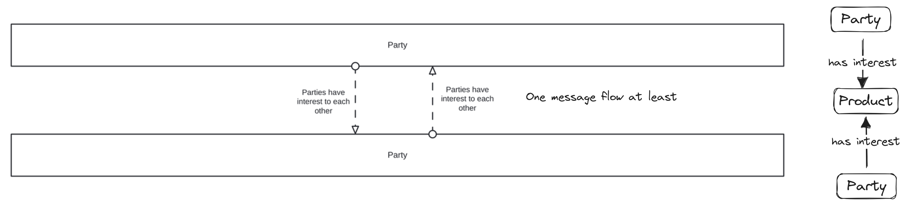
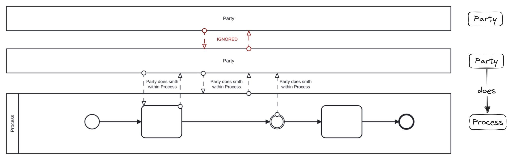
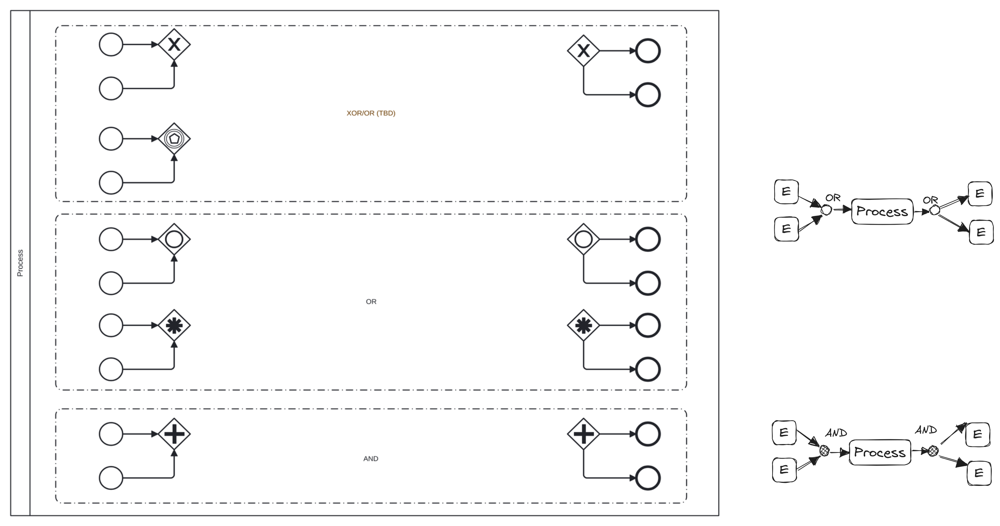

###### :green_book: bpmn_interprets.md

---

# Интерпретация BPMN 2.0

1. Pool (blackbox) -- Party
1. MF btw 2 blackboxes -- Parties have interest in some Product

1. Pool (whitebox) -- Process
1. MF btw blackbox and whitebox -- Party does smth in Process
1. MF btw blackbox and Task or Intermediate Event -- Party does smth in Process
1. Start/End Events -- Triggers Process and Results accordingly 

1. Start/End Events w Gateways -- collapses to simple OR and AND 
_
