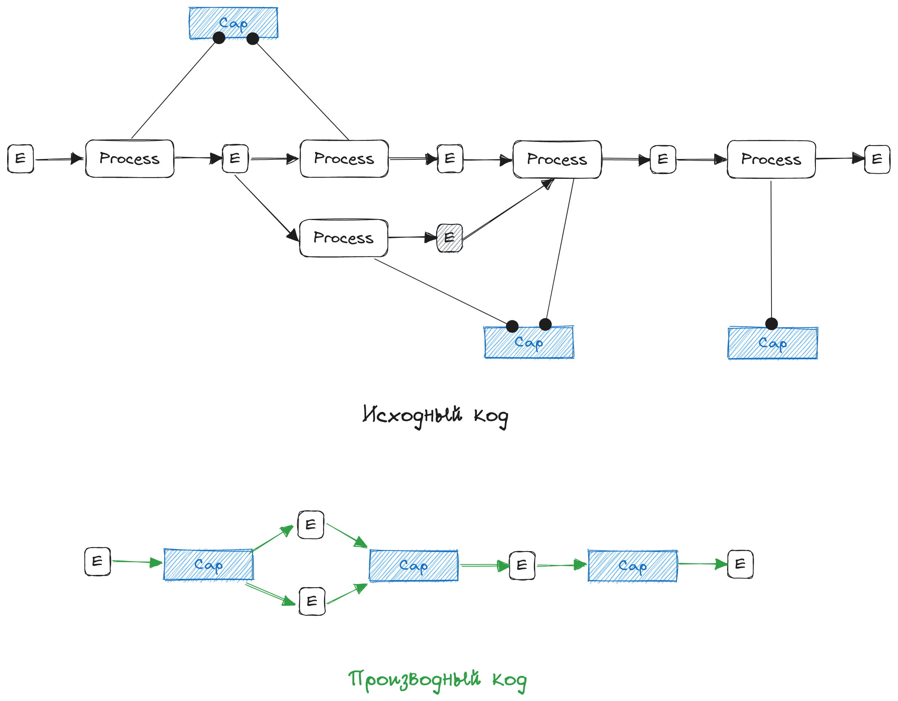
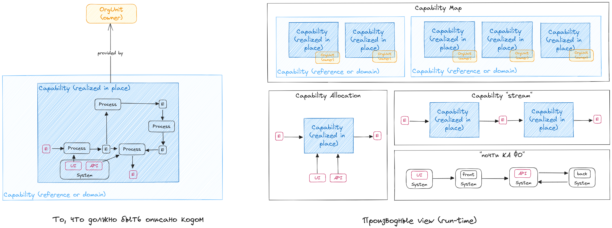

###### :orange_book: capability_main.md
# Capabilities, (а)ФБС, компетенции

**Capability** -- реализованная цельная функциональность для решения стандартной бизнес-задачи.

* функциональность -- набор или порядок действий совершаемых в требуемый момент с результатом, соответсвующим ожиданиям в определенной (статистически подтвержденной) степени.
* реализованная -- способы, место, ресурсы не только определены, но и фактически существуют. Capability, может быть в состоянии "планируется", "пилот" и пр., но ее будущее целевое состояние отражает функциональность существующую в определенном месте и времени. Capabilities обычно группируют в более крупные Capabilities, но это уже не способности, а группы способностей, или домены, или референсные способности, поскольку они не обладают, как правило цельностью.
* стандартная бизнес-задача -- задача, которая возникает постоянно или периодически. Ее решение является необходимым для предоставления Продукта на рынок или существования бизнеса как такового. Повторяемость задачи подразумевает, что она ясным образом идентифицируется, имеет условия ее решения и требования к результату решения.
* цельная -- если способность задействуется для решения задачи, то она задействуется целиком. В рамках способности может быть заключена вариативность действий, но в целом каждый отдельный сценарий решения задачи определяется логикой внутри Capability, а не выбирается "за пределами" способности. В последнем случае следует рассматривать несколько способностей для решения разных задач.

### PoC

### Целевая функциональность по моделированию ФБС
