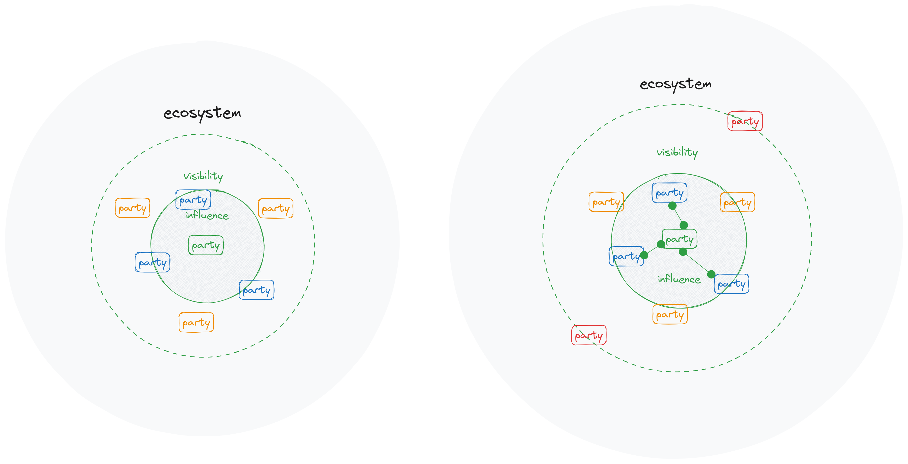

###### :orange_book: ecosystem_concept.md

---

[ draft ]
# Экосистемное видение (концепция)

#### Определение экосистемы

**Экосисте́ма**, или **экологи́ческая систе́ма** (от др.-греч. οἶκος — жилище, местопребывание и σύστημα — «целое, составленное из частей; соединение») — основная природная единица на поверхности Земли, совокупность совместно обитающих организмов (биотических) и условий их существования (абиотических), находящихся в закономерной взаимосвязи друг с другом и образующих систему ([БРЭ](https://bigenc.ru/c/ekosistema-cb7f92)).

**... природная единица ...**
* природная -- созданная без участия человека
* единица -- представляющая из себя целое

**Человек** -- часть экосистемы. Из всего остального биома человека выделяют следующие способности:
* желать чего-то сверх удовлетворения естественных потребностей (ставить цели);
* воображать и создавать что-то, чего нет в природе, для достижения целей.

Эти способности обусловили возникновение социально-экономических отношений, проявляющихся, в частности, в совместной деятельности для производства и обмена ценностью и получения (максимизации) индивидуальной выгоды. Таким образом, можно сказать, что социально-экономическая экосистема -- есть основная **искусственная единица** Земли, совокупность людей, искусственно созданных результатов их деятельности и настроений, определяемых соотношением желаемых и фактических условий существования.

#### "Теория ограничений"

Хотя способность к целеполаганию и креативность считаются (людьми) преимуществами человека над другими живыми организмами, в рамках всей экосистемы возможности отдельного индивидуума ограничены:
* естественным образом (природой) -- по своей силе (capacity) и продолжительности (continuity);
* искусственным образом (социально-экономической подсистемой) -- по правам на использование ресурсов (в том числе природных) и по возможности обмена ценностью (как законодательно, так и конъюнктурно).

Индивидуум действует в рамках имеющихся ограничений, то есть имеет некоторую свободу воздействовать на часть экосистемы вокруг себя. Действуя индивидуально в своей зоне влияния, человек быстро достигает ее границ. Но устанавливая социально-экономические отношения с другими индивидуумами (новыми контрагентами), образуя организацию или становясь частью организации целенаправленно взаимодействующих участников (Parties) экосистемы, человек увеличивает:
* свою зону влияния (см.рисунок ниже);
* зону влияния организации в целом;
* индивидуальные зоны влияния других членов организации. 

Образование оганизаций может решать задачи преодоления ограничений путем:
* масштабирования деятельности:
    * если в зоне влияния есть еще потенциальные контрагенты;
    * если сила влияния позволяет установить с ними отношения.
* расширения видов деятельности;
    * тоже самое - в чем разница-то?
    * 

#### Parties

Поскольку организации искусственно образованы и состоят из Party-индивидуумов, имеющих цели, то будет правильным говорить, что их цели имеют проекцию на организацию в целом, а значит и организация:
* имеет цели, и значит
    * является Party.

субъективные точки зрения индивидуумов

 Образование оганизаций может решать задачи преодоления ограничений путем:
* масштабирования деятельности;
* расширения видов деятельности;

Даже крупные и сравнительно устойчивые организации (группы целенаправленно взаимодействующих индивидуумов) рано или поздно достигают таких ограничений. Назовем эту ситуацию 

иналичие таких способностей считается преимуществом человека над другими природными элементами экосистемы, их сила влияния (capacity) и продолжительность (continuity), в том числе с точки зрения достижения целей, мала в сравнении с силами природных элементов. Поэтому человек в поисках способов увеличения силы и устойчивости своих способностей может обратиться к наблюдению естественных подсистем Земли и попытаться заимствовать некоторые паттерны для переиспользования в искусственных подсистемах.

Именно такое заимствование явно или неявно происходит в современный период социально-экономического развития, когда человек пытается осознанно расширять свое влияние за пределы непосредственно взаимодействующих подсистем и строить более мощные и надежные надсистемы для лучшего достижения целей или достижения бОльших целей. То есть, применяя паттерны естественных экосистем, человек строит искусственные социально-экономические системы или, другими словами, *искусственные экосистемы*.

*Для обозначения искусственных экосистем, далее будет использоваться термин "экосистема" в узком социально-экономическом смысле, если не указано иное.*

Описание экосистем, как и в более ранние периоды истории в отношении "простых" систем, служит двум целям:
* повышение качества эксплуатации (устойчивое достижение целей);
* изменение в ответ на изменение целей и/или условий надсистемы.

Однако, с учетом экспоненцильно возрастающей сложности при переходе от управления "простыми" системами к управлению "экосистемой", значимость описания экосистемы возрастает еще до того, как экосистемное управление перейдет в практическую плоскость. Возрастание сложности обусловлено необходимостью сбалансировать (выровнять, to align, to level):
* бОльшее количество и разнообразие целей;
* бОльшее количество и разнообразие зависимостей между элементами.

### Границы и центр экосистемы

У природных экосистем не существует четких границ (за исключением отдельных случаев, так называемых, "замкнутых"). Цепочки зависимостей между элементами *возможно* замыкаются где-то за пределами поля зрения наблюдателя. Попробуем применить это понимание к искусственной экосистеме.

Допустим, **Мы (кто?)** имеем некую цель, не достижимую в рамках видимой системы и ее ближайшего окружения. Это значит, что досягаемые нашему влиянию элементы исчерпали свою capacity. Но если попытаться рассмотреть более дальние элементы окружения, то, хотя это не добавит нам влияния, это расширит знание о зависимостях более высокого ранга относительно нашего "местоположения" (точки зрения). Расширяя знание об окружении, можно обнаружить, что существуют зависимости различного ранга с нашей системой, которые ранее не рассматривались как окружение, поскольку их влияние на достижение цели не было "видно".

Наша цель только что превратилась из недостижимой в вероятную. 

В ряде случаев, мы можем увидеть не только неизвестные ранее зависимости, но и потенциал взаимодействия между дальними элементами, который пока еще не реализован, но такая новая зависимость, замкнет некоторую цепочку, через которую мы можем проявить свое влияние. Таким образом, экосистемное знание раскрывает нам новые возможности по достижению целей и созданию зависимостей для достижения целей. Более амбициозные цели становятся достижимыми. Чем шире наше знание, тем больше возможностей (силы) и устойчивости (вариативности) мы осознаем, а значит можем попробовать использовать.

Это приводит нас к мысли, что границы искусственной экосистемы существуют только в воображении Наблюдателя. Фактически граница экосистемы совпадает с границами знания. "Построение" экосистемы - есть расширение контекста и использование данных контекста для реализации  способностей (не увеличения, поскольку способности -- есть константа в глобальном масштабе). 

Мы рассмотрели ситуацию, когда один создатель искусственной подсистемы усилил реализует свои способности через применение экосистемного взгляда "вокруг себя". Не смотря на то, что он увидел новые возможности во взаимодействии своей подсистемы с другими подсистемами, а также и во взаимодействии сторонних подсистем, его влияние все еще может быть недостаточным для создания новых отношений. Контрагенты могут не соглашаться (если могут) на установление новых зависимостей поскольку не видят влияния на свои цели. В таких случаях могут возникать ограниченные (пределами власти визионера) экосистемы, характеризующиеся некоторой степенью централизации (не намекаю ни на что).

Однако, если потенциальный контрагент также принимает "экосистемность", то вероятность обнаружения взаимно полезных зависимостей и согласия их реализовать повышается, поскольку "видимость экосистемы" из двух точек зрения значительно выше, чем из одной. В этом случае возникает более децентрализованная экосистема. Если таких "участников" экосистемы много,то устойчивость и сила каждого в достижении его целей существенно возрастает (в рамках экосистемы). 

В идеальном случае каждый является центром своей экосистемы и расширяет ее за счет реализации новых и новых зависимостей. Это предполагает равное влияние на других участников. В реальном мире, власть не равнораспределена, что приводит к ограничениям и установлению неэкосистемных зависимостей, то есть к ограниченности возможностей по реализации человеческих способностей (устанавливать цели и создавать). Поэтому сколь бы крупной ни была централизованная экосистема, рано или поздно, она достигнет границ своей власти и, возможно, столкнется с противодействием другой централизованной экосистемы.

Таким образом, второй паттерн, который мы могли бы заимствовать из природных экосистем - это децентрализация, хотя бы в какой-то ее степени, поскольку именно это делает экосистему "непрерывной" во всех смыслах этого слова.

### Метамодель экосистемы

Итак, если мы говорим об искусственных системах, то было бы не правильно упускать причину их создания и существования в текущий момент времени. Если система создана и существует в определенный момент времени, то она служит достижению цели создателя/владельца (stakeholder). В противном случае, она в отличие от природной системы, должна перестать существовать.

Созданная система может быть замкнутой -- нужно ли уходить в эту степь?

Система должна участвовать в обмене ценностью с другими системами (первое приближение к экосистемности). В противном случае она оказывается замкнутой, имеет потенциал, ограниченный властью владельца, 

Знание интересов различных сторон формирует видимую экосистему Наблюдателя. Построение или управление экосистемой -- есть действование в областях, находящихся вне 100% власти, но придающее capacity and continuity в достижении бОльших целей.
Преодоление сложности экосистемного знания и получение выгоды из него -- есть задача архитектуры экосистемы как результата познания и как процесса.

Интерес в системе может проявляться по-разному:
* получение выгоды от существования (симбиоз, паразитизм)
* получение выгоды от владения системой (территория)
* получение выгоды от взаимодействия с системой (потребление-возмещение)

Нужно ответить на вопрос что есть участник, почему система тоже участник, почему Продукт, будучи системой, не является участником. Является ли Человек системой и если нет, то почему он Party? Человек безусловно элемент, но это намек на элементарность, то есть неделимость, то есть человек - не система. Система психо-биологическая, но не искусственно созданная между прочим. Поэтому мы можем говорить, что человек это и целая экосистема и элемент и gateway to nature from social (artificial) world. видимо есть черта между стаей (хотя бы даже и с иерархией) и социумом (хоть с каким-то интересом, обманом и захватом власти). Целеполагание и прогрессирующие амбиции привели к тому, что в социуме существует являение захвата власти больше естественной.

