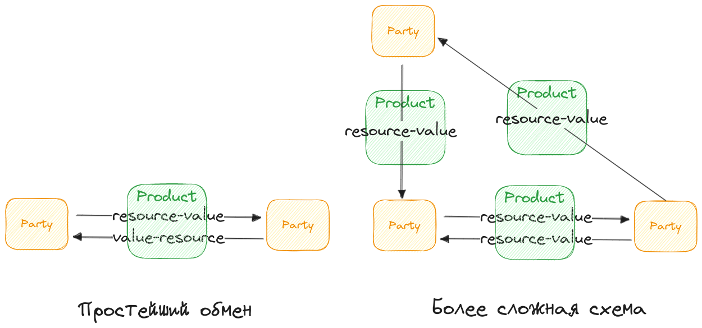
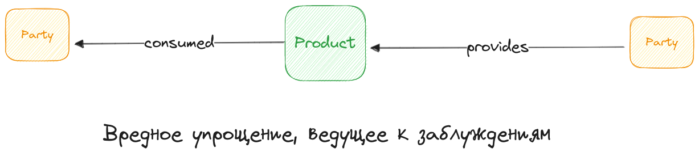
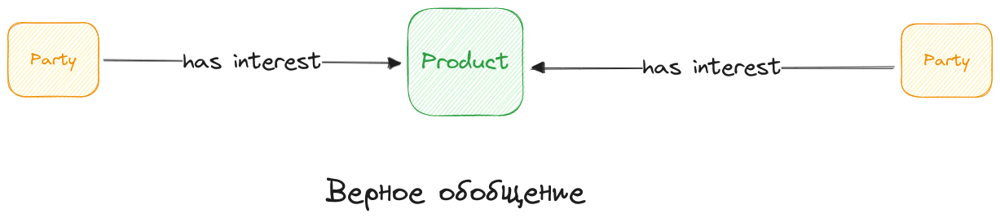
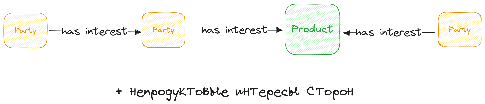
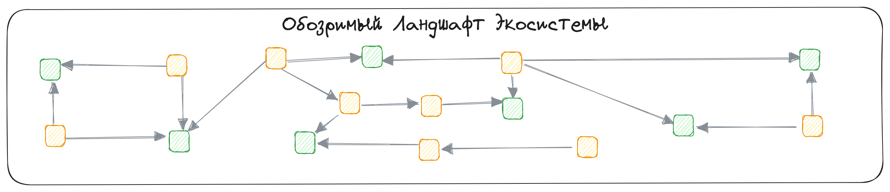
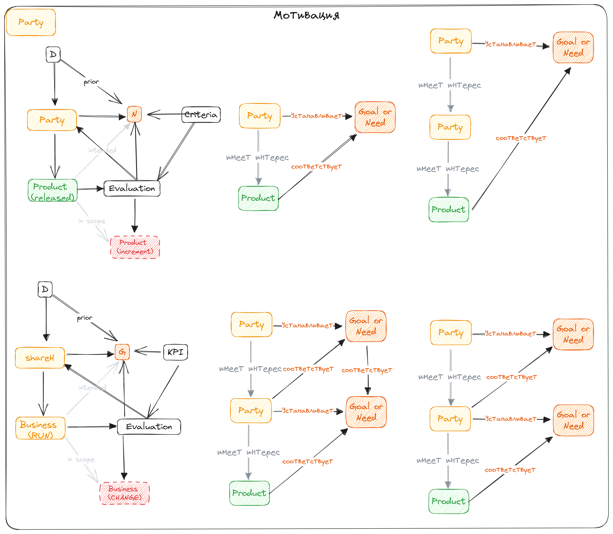

###### :green_book: ecosystem_main.md
# Экосистема

### Метамодель

Экосистема образована из Сторон, имеющих встречные интересы.

Иметь интерес -- значит иметь цель или потребность, а также ресурсы, которые могут представлять ценность для другой стороны, и готовность обменять эти ресурсы на что-то ценное для себя.

Способ, с помощью которого осуществляется обмен ресурсами-ценностью, будем называть Продуктом:

Из приведенных выше схем нужно извлечь одну простую мысль. Участники, независимо от их роли в Продукте (Провайдер, Покупатель, Акционер, Партнер) что-то отдают через Продукт, и что-то получают через Продукт. То есть взаимодействие между Стороной и Продуктами всегда двустороннее и в реальности взаимодействия имеют бОльшую сложность и большОе разнообразие. 

Единственное неискажающее суть обобщение, которое мы можем сделать в отношении Продуктов и Сторон -- это то, что Стороны могут иметь встречные интересы в отношении одного и того же Продукта.

Участник (Сторона) -- это сущность, способная проявлять желания, требования, ставить цели и определять с помощью чего и как эти цели могут быть достигнуты.

Продукт -- это обособленный сценарий, принимая участие в котором, Стороны намерены осуществить обмен ценными ресурсами, в идеале, с выгодой для себя, но, как минимум, достугнув цели и удовлитворив потребность. Характерными признаками Продукта явяляются договор, SLA или иная форма соглашения об обмене.

Если цель или потребность Участника может быть удовлетворена путем участия в (сценарии) Продукта, то Сторона "имеет интерес" в Продукте.

Такой фреймворк имеет очевидную продуктово-потребительскую направленность, поэтому его надо расширить таким образом, чтобы отразить "непотребительские" интересы Сторон. Например, Акционеров, Государственных органов, Общественных и отраслевых объединений и прочих интересантов, которые имеют интерес в Организации (бизнесе, компании), но при этом не участвуют в прямом обмене ценностью.

### Границы экосистемы, Слон со всех сторон

Границ экосистемы не существует. Существует граница поля зрения Наблюдателя.

Применяя метамодель из предыдущего раздела для описания обозримого бизнес-ландшафта, мы получим схему следующего вида:

Тут мы видим границы -- значит это чья-то точка зрения. Кто-то, кто является одним из Участников на этой схеме. Один или несколько Участников, которые отобразили свое поле зрения на одной схеме.

Какие еще Стороны должны войти в эту схему?

Поверхностный ответ -- ДЗО, крупные Партнеры и Клиентские сегменты. Правильный ответ -- все Стороны, имеющие встречные интересы с ДЗО, крупными Партнерами и Клиентскими сегментами. Они тоже часть Экосистемы. 

Что мы упускаем чаще всего при описании экосистемы:
* Конкурентов, хотя они затрагивают "наши" клиентские сегменты, а еще являются поставщиками для сегментов, о которых мы не знаем
* Внешних поставщиков, хотя они являются потенциальными объектами M&A и, как минимум, часть Экосистемы имеет зависимость от них
* Госорганы , СМИ и других тренд-сеттеров, способных изменить картину интересов в Экосистеме

Конечно, указанные выше Стороны находятся в зоне внимания каких-то корпоративных ролей, но они точно выпадают из EA, а значит вся целевая архитектура "не учитывает" их интересы и влияние.

[Пример: Видимая экосистема](/entities/ttl/view?id=ecosystem_aspect)

Карта интересов должна представлять из себя единый справочник, принятый всеми заинтересованными сторонами.

* **Кто эти заинтересованные стороны?**
    * ГК The Ogorod  -- Холдинг, который "осознает" необходимость экосистемного видения. А именно, Руководство ГК/Визионеры Экосистемы, принимающие решения M&A и распределяющие бюджет развития Экосистемы.
    * Ромашка, Березка -- ДЗО ГК, "осознающие" себя частью экосистемного видения ГК, а потому ожидающие неких эко-бенефитов (от синергии и клиентских сегментов соседей), но сначала должные предоставить свое окружение в общую картину.
* **Кто составил карту?**
    * Экосистемный архитектор ГК

        _У Наблюдателя, который находится в центре "своей" Экосистемы есть естественные ограничения поля зрения. Но если с помощью SEAF, мы будем культивировать идеи федеративного управления архитектурой, то это сильно повысит "дальность" зрения._

Интересы и позиция наблюдателя у всех Сторон -- разные, поэтому каждый заинтересованный может использовать собственную разметку Экосистемы. При этом основа (справочник сущностей) остается единым.

[Пример: Частные разметки](/entities/ttl/dimension?id=ecosystem_mappings)

*По сути -- это "слон" со всех сторон, а значит можно собрать синтетическую insightefull разметку*. Например зрелость, вендорлоки, целевое и пр.

### Детализации

